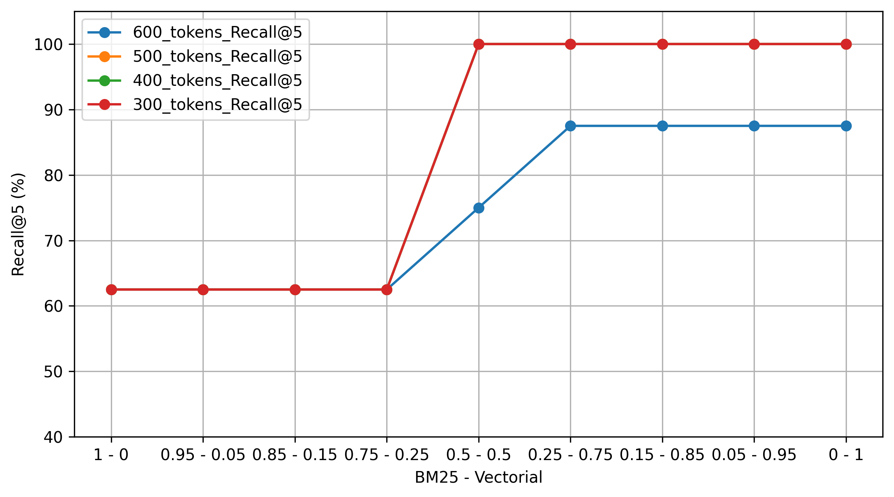
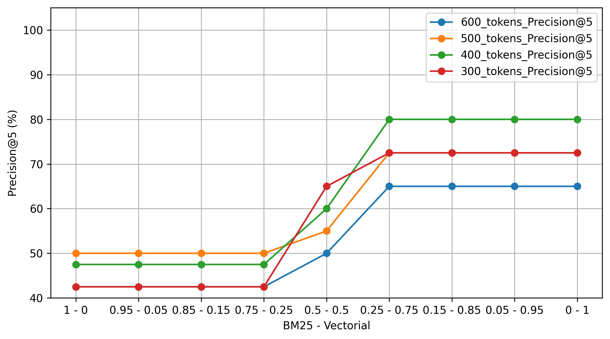

# Sistema RAG Escalable en la Nube con Pinecone (Pre-Entrega 4)

Proyecto correspondiente a la Pre-Entrega 4 del curso de AI Engineering.

## Descripción

Sistema de recuperación híbrida y generación aumentada por recuperación (RAG) utilizando LangChain, Pinecone, BM25, embeddings y Google Gemini.

El proyecto implementa un pipeline RAG orientado a la consulta de documentos académicos relacionados con metodología de la investigación y estadística.

A diferencia de la entrega anterior, en esta versión la recuperación vectorial se realiza utilizando **Pinecone Serverless** como infraestructura de almacenamiento y búsqueda en la nube, y se incorpora un recuperador híbrido que combina similitud semántica y búsqueda léxica mediante BM25.

El sistema permite:

* Ingestar documentos académicos procesados previamente.

* Limpiar y dividir los documentos en fragmentos (*chunks*).

* Medir el tamaño de los fragmentos utilizando tokens mediante `tiktoken`.

* Generar embeddings mediante `sentence-transformers/all-MiniLM-L6-v2`.

* Crear y configurar un índice Serverless en Pinecone.

* Almacenar los embeddings y el contenido de los fragmentos directamente en Pinecone mediante metadatos.

* Asociar metadatos adicionales a cada fragmento, incluyendo fuente, página, categoría e identificador del chunk.

* Utilizar similitud coseno para la recuperación vectorial.

* Utilizar BM25 para la recuperación léxica.

* Combinar ambos métodos mediante `EnsembleRetriever`.

* Recuperar los 5 fragmentos más relevantes para cada consulta.

* Construir el contexto que será enviado al modelo.

* Generar respuestas mediante Google Gemini.

* Validar la salida del modelo mediante Pydantic.

* Informar las fuentes, páginas, categorías e identificadores de los fragmentos recuperados.

* Clasificar errores del proveedor mediante excepciones personalizadas.

* Evaluar el recuperador mediante un Golden Set utilizando Precision@5 y Recall@5.

* Ejecutar pruebas automatizadas mediante `pytest`.

* Ejecutar las pruebas automáticamente mediante GitHub Actions.

El modelo LLM se configura con un rol de **docente universitario especializado en metodología de la investigación y estadística**. El prompt establece que la respuesta debe basarse exclusivamente en la información recuperada de los documentos y que, si la información solicitada no está disponible en el contexto, debe indicarlo explícitamente.

## Requisitos

* Python 3.11+

* API key de Google Gemini.

* API key de Pinecone.

* Cuenta de Pinecone con acceso a índices Serverless.

## Tecnologías utilizadas

* Python

* asyncio

* Pydantic

* LangChain

* LangChain Core

* LangChain Text Splitters

* LangChain Pinecone

* Pinecone

* BM25

* Hugging Face

* Sentence Transformers

* tiktoken

* pytest

* pytest-asyncio

* GitHub Actions

* Ruff

**Nota**: Se utilizó Python 3.11.9 para asegurar la compatibilidad con las dependencias del proyecto, siguiendo la corrección indicada en la Pre-Entrega anterior.
## Variables de entorno

El proyecto utiliza las siguientes variables de entorno:

* `GOOGLE_API_KEY`

* `PINECONE_API_KEY`

* `INDEX_NAME`

Crear un archivo `.env` a partir de `.env.example` y completar las variables correspondientes.

La API keys reales no se incluyen en el repositorio.

El archivo `.env` se encuentra excluido mediante `.gitignore`.

Para la ejecución de los tests mediante GitHub Actions, las API keys se almacenan como **Repository Secrets** y son inyectadas como variables de entorno durante la ejecución del workflow.

## Infraestructura de Pinecone

El proyecto utiliza un índice **Pinecone Serverless** con las siguientes características:

* Índice: `statistics-methodology`

* Dimensión: `384`

* Métrica: `cosine`

* Modelo de embeddings: `sentence-transformers/all-MiniLM-L6-v2`

* Namespace: `Statistics_and_methodolgy_texts`

El script de configuración verifica si el índice existe y, en caso contrario, crea la infraestructura necesaria.

El contenido de cada fragmento se almacena directamente dentro de los metadatos de Pinecone, evitando la necesidad de realizar una consulta adicional a una base de datos relacional para recuperar el texto original.

## Pipeline RAG

El procesamiento se organiza en las siguientes etapas:

```text
Documentos
      ↓
Ingesta
      ↓
Limpieza y chunking
      ↓
Embeddings
      ↓
Pinecone Serverless
      ↓
      ├───────────────┐
      ↓               ↓
Búsqueda vectorial   BM25
      ↓               ↓
      └───────┬───────┘
              ↓
     EnsembleRetriever
              ↓
     Fragmentos relevantes
              ↓
  Construcción del contexto
              ↓
            Prompt
              ↓
        Google Gemini
              ↓
    PydanticOutputParser
              ↓
         RAGResponse
```

Los documentos son divididos mediante `RecursiveCharacterTextSplitter`.

Luego de realizar diferentes pruebas sobre el Golden Set, se seleccionó una configuración de **400 tokens por chunk y 100 tokens de overlap**, al presentar el mejor desempeño observado durante la evaluación.

El retriever híbrido combina búsqueda léxica mediante BM25 y búsqueda semántica mediante Pinecone.

La configuración utilizada para el `EnsembleRetriever` asigna los siguientes pesos:

* BM25: `0.25`

* Búsqueda vectorial: `0.75`

Esta configuración fue seleccionada a partir de la comparación de distintas combinaciones de pesos utilizando Precision@5 y Recall@5.

El sistema recupera los **5 documentos más relevantes** para cada consulta.

## Recuperador híbrido

El sistema combina dos estrategias de recuperación:

**Búsqueda vectorial**

Utiliza embeddings generados mediante `sentence-transformers/all-MiniLM-L6-v2` y almacenados en Pinecone. La recuperación se basa en similitud coseno entre la consulta y los fragmentos almacenados.

**Búsqueda léxica**

Utiliza BM25 para identificar coincidencias relevantes entre los términos de la consulta y el contenido de los documentos.

**EnsembleRetriever**

Los resultados de ambos recuperadores se combinan mediante `EnsembleRetriever`, utilizando los pesos definidos experimentalmente.

Esta combinación permite aprovechar tanto la similitud semántica como la coincidencia directa de términos técnicos y nombres propios.

## Evaluación

Se incorporó un Golden Set de consultas relacionadas con el corpus utilizado por el sistema. El Golden Set está compuesto por 10 preguntas, cada una asociada a un documento fuente esperado. De estas, 8 preguntas cuentan con una fuente presente en el corpus y se utilizan para el cálculo de las métricas. Las 2 preguntas restantes corresponden a casos en los que la fuente esperada no se encuentra disponible en el corpus, por lo que se excluyen del cálculo de Precision@5 y Recall@5.

Cada consulta tiene asociado un documento fuente esperado, lo que permite evaluar si el recuperador logra encontrar el documento relevante dentro de los primeros 5 resultados.

Las métricas utilizadas son:

* **Recall@5:** indica si el documento esperado aparece entre los 5 documentos recuperados.

* **Precision@5:** indica qué proporción de los 5 documentos recuperados son considerados relevantes para la consulta.

La evaluación se realiza mediante `evaluate.py`.

Para ejecutar la evaluación:

```bash
python evaluate.py
```

El script imprime en consola un resumen de las métricas obtenidas.

### Resultados de la evaluación

Además de la evaluación realizada sobre la configuración final, se realizaron pruebas adicionales sobre el `EnsembleRetriever` para analizar el efecto de dos parámetros: el tamaño de los chunks y la proporción de pesos asignada a la búsqueda BM25 y a la búsqueda vectorial.

El objetivo fue determinar qué combinación permitía obtener el mejor desempeño sobre el Golden Set utilizado, evaluando mediante **Recall@5** y **Precision@5**.

#### Recall@5

La Figura 1 muestra el Recall@5 obtenido para diferentes combinaciones de pesos entre BM25 y búsqueda vectorial, utilizando distintos tamaños de chunk.

**Figura 1.** *Recall@5 según la proporción de pesos entre BM25 y búsqueda vectorial para diferentes tamaños de chunk*.


Los valores más altos de Recall@5 se obtuvieron con chunks de **500, 400 y 300 tokens**, alcanzando el 100% para varias de las configuraciones evaluadas. En cambio, los chunks de 600 tokens presentaron un Recall menor en las configuraciones con mayor peso vectorial.

En este conjunto de pruebas, los resultados sugieren que el tamaño de los chunks tuvo un efecto relevante sobre la capacidad del sistema para recuperar información pertinente. Sin embargo, el comportamiento también dependió de la combinación de pesos utilizada en el `EnsembleRetriever`.

**Nota:** Algunas configuraciones presentan valores idénticos de Recall@5, por lo que sus líneas se superponen en el gráfico (línea roja). Esto refleja que, sobre el Golden Set utilizado, dichas configuraciones tuvieron el mismo desempeño en Recall@5.

#### Precision@5

La Figura 2 presenta los resultados de Precision@5 para las mismas combinaciones de pesos y tamaños de chunk.

**Figura 2.** *Precision@5 según la proporción de pesos entre BM25 y búsqueda vectorial para diferentes tamaños de chunk*.



Los mejores valores de Precision@5 se obtuvieron con un tamaño de **400 tokens**. En este caso, la precisión alcanzó su máximo con una proporción de **0.25 para BM25 y 0.75 para la búsqueda vectorial**. A partir de esta configuración, aumentar el peso de la búsqueda vectorial no produjo una mejora adicional en Precision@5 sobre el Golden Set utilizado.

### Configuración seleccionada

A partir de los resultados obtenidos, se seleccionó la siguiente configuración para el sistema:

* **Chunk size:** `400` tokens.
* **Chunk overlap:** `100` tokens.
* **Top-k:** `5`.
* **Peso BM25:** `0.25`.
* **Peso búsqueda vectorial:** `0.75`.

Esta configuración permitió alcanzar un **Recall@5 del 100%** y la mayor **Precision@5 observada (80%)** entre las configuraciones de tamaño de chunk evaluadas.

### Comparación de configuraciones

Para analizar específicamente el impacto del tamaño de los chunks, se mantuvo un `overlap` de 100 tokens y se evaluaron cuatro tamaños diferentes:

| **Chunk size** | **Precision@5** | **Recall@5** |
| -------------: | --------------: | -----------: |
|            600 |             65% |        87.5% |
|            500 |           72.5% |         100% |
|            400 |             80% |         100% |
|            300 |           72.5% |         100% |

A partir de estos resultados se seleccionó un tamaño de **400 tokens**, ya que obtuvo la mayor Precision@5 manteniendo un Recall@5 del 100% sobre el Golden Set utilizado.

También se evaluaron diferentes pesos para el `EnsembleRetriever`. La configuración seleccionada fue `0.25` para BM25 y `0.75` para la búsqueda vectorial, correspondiente a la mejor combinación observada en las pruebas realizadas sobre este corpus.

Estos resultados son específicos del corpus y del Golden Set utilizados y no representan necesariamente el comportamiento del recuperador sobre otros conjuntos de documentos.

### Reproducción del análisis

Para reproducir el análisis de las diferentes configuraciones del `EnsembleRetriever`, ejecutar:

```bash
python -m tests.test_analizar_weights
```

El análisis de los pesos del `EnsembleRetriever` se realiza sobre los documentos y chunks actualmente disponibles en Pinecone.

Para evaluar un tamaño de chunk diferente, es necesario modificar el valor de `chunk_size` en `chunking.py` y volver a generar la base vectorial. Para ello, se debe eliminar el índice o namespace existente y ejecutar nuevamente el proceso de ingesta, de modo que los documentos sean procesados y almacenados utilizando la nueva configuración de chunking.

Una vez generada nuevamente la base, se puede ejecutar el script de análisis para comparar los resultados de Precision@5 y Recall@5.

Ademas pandas y matplotlib se utilizan para el análisis y visualización de los resultados experimentales incluidos en la carpeta analysis/.

## Ejecución

El script principal realiza una consulta de prueba sobre los documentos disponibles.

Para ejecutar el sistema:

```bash
python main.py
```

La respuesta incluye:

* La respuesta generada por el modelo.

* Los archivos utilizados como fuente.

* Las páginas recuperadas.

* Las categorías de los documentos recuperados.

* Los identificadores de los chunks recuperados.

* La cantidad de fragmentos recuperados.

## Ingesta

La infraestructura y la ingesta de documentos se gestionan mediante `db_ingest.py`.

El proceso verifica la existencia del índice y carga los documentos procesados en Pinecone cuando corresponde.

Los documentos se dividen en chunks y cada fragmento se almacena junto con metadatos que permiten identificar su procedencia.

Entre los metadatos almacenados se incluyen:

* `fuente`

* `pagina`

* `categoria`

* `chunk_id`

* contenido original del fragmento

El uso de namespaces permite mantener separados los conjuntos de datos dentro del índice.

## Manejo de errores

Se implementó una clasificación de errores mediante `LLMErrorType` y la excepción personalizada `LLMError`.

Actualmente se contemplan:

* `RATE_LIMIT`: límite de solicitudes alcanzado por el proveedor.

* `UNKNOWN`: error no contemplado específicamente.

Los errores `429` provenientes de `ClientError` de Google GenAI son identificados como errores de límite de solicitudes.

## Logging

Se incorporó el módulo estándar `logging` de Python para registrar eventos relevantes durante la ejecución del pipeline.

Los mensajes se clasifican según su nivel de importancia:

* `INFO`: información sobre el procesamiento, creación de chunks, configuración de infraestructura y recuperación de documentos.

* `ERROR`: errores ocurridos durante la ejecución del pipeline.

La configuración utiliza el nivel `INFO`, por lo que se muestran en consola los mensajes `INFO` y los niveles superiores (`WARNING`, `ERROR` y `CRITICAL`).

Los logs permiten observar el funcionamiento del sistema durante la ejecución y facilitan la identificación de errores.

## Testing

Se incorporaron pruebas automatizadas utilizando `pytest` y `pytest-asyncio`.

Las pruebas permiten verificar distintos componentes del sistema y evaluar el funcionamiento de la recuperación y la lógica de procesamiento.

Se incluyen pruebas para:

* Procesamiento y generación de chunks.

* Configuración de la infraestructura de Pinecone.

* Recuperación vectorial.

* Recuperación híbrida.

* Similitud entre documentos.

* Evaluación de distintas configuraciones del retriever.

* Orquestación del sistema RAG.

* Clasificación de errores.

* Manejo de errores mediante objetos simulados (*mocking*).

### Ejecución de los tests

Los tests se encuentran dentro de la carpeta `tests/`.

Para ejecutar una prueba específica:

```bash
python -m pytest tests/test_chunking.py
```

También pueden ejecutarse todas las pruebas del proyecto mediante:

```bash
python -m pytest
```

Las pruebas asíncronas utilizan `pytest-asyncio` para permitir la ejecución de funciones definidas con `async def`.

En las pruebas que requieren componentes externos se utilizan las variables de entorno correspondientes y objetos simulados cuando resulta necesario evitar llamadas reales al proveedor.

## Integración continua

Se incorporó **GitHub Actions** para ejecutar automáticamente la suite de tests.

El workflow se ejecuta ante:

* `push`

* `pull_request`

El entorno de ejecución utiliza Python 3.11 y realiza los siguientes pasos:

```text
Checkout del repositorio
        ↓
Configuración de Python
        ↓
Instalación de dependencias
        ↓
Ejecución de pytest
```

El proyecto utiliza además un archivo pytest.ini para configurar el pythonpath y permitir que los tests importen correctamente los módulos ubicados en el directorio raíz del proyecto, tanto en el entorno local como en GitHub Actions.

```ini
[pytest]
pythonpath = .
```

Las credenciales necesarias para ejecutar los componentes que utilizan servicios externos se almacenan como Repository Secrets de GitHub.

La suite de tests se ejecuta correctamente tanto en el entorno local como en GitHub Actions.

## Calidad y buenas prácticas

Se utiliza Ruff como herramienta de análisis y formateo del código.

Para formatear automáticamente el proyecto:

```bash
ruff format .
```

Para analizar el código sin modificarlo:

```bash
ruff check .
```

El formateo automático se utiliza para mantener una estructura consistente, mientras que las sugerencias de `ruff check` se revisan manualmente.

## Estructura del proyecto

```text
├── analysis/                              # Análisis y visualización de resultados
│   ├── analisis_resultados.ipynb          # Notebook para el análisis experimental
│   ├── preentrega4_datos_recall.csv       # Datos de Recall@5
│   ├── preentrega4_datos_precision.csv    # Datos de Precision@5
│   ├── recall_at_5.png                    # Gráfico de Recall@5
│   └── precision_at_5.png                 # Gráfico de Precision@5
│
├── data/                                  # Documentos utilizados como fuente del RAG
│   ├── Pagano 2006 CAP 6 - Estadística para las ciencias del comportamiento, correlacion.pdf
│   ├── Pagano 2006 CAP 7 - Estadística para las ciencias del comportamiento, regresion.pdf
│   ├── Pagano 2006 CAP 8 - Estadística para las ciencias del comportamiento, muestra probabilistica.pdf
│   ├── Pagano 2006 CAP 8 - Estadística para las ciencias del comportamiento, probabilidad.pdf
│   ├── Sampieri 2018 CAP 7 - Metodología de la investigación, diseño experimental.pdf
│   ├── Sampieri 2018 CAP 7 - Metodología de la investigación, diseño no experimental.pdf
│   ├── Sampieri 2018 CAP 8 - Metodología de la investigación, muestra no probabilistica.pdf
│   ├── Sampieri 2018 CAP 8 - Metodología de la investigación, muestra probabilistica.pdf
│   └── Sampieri 2018 CAP 8 - Metodología de la investigación, seleccion de la muestra.pdf
│
├── tests/                                 # Pruebas automatizadas
│   ├── test_analizar_weights.py           # Tests de evaluación de pesos
│   ├── test_chunking.py                   # Tests del procesamiento y chunking
│   ├── test_errors.py                     # Tests de clasificación de errores
│   ├── test_rag.py                        # Tests del sistema RAG
│   ├── test_schemas.py                    # Tests de validación de los esquemas
│   ├── test_setup.py                      # Tests de configuración de infraestructura
│   └── test_similitud.py                  # Tests de similitud
│
├── .github/
│   └── workflows/
│       └── tests.yml                      # Workflow de GitHub Actions
│
├── .env.example                           # Ejemplo de variables de entorno
├── .gitignore
├── chain.py                               # Modelo Gemini, parser y cadena LCEL
├── chunking.py                            # Limpieza y división de documentos
├── db_config.py                           # Configuración de embeddings y Pinecone
├── db_ingest.py                           # Configuración e ingesta en Pinecone
├── errors.py                              # Clasificación y manejo de errores
├── evaluate.py                            # Evaluación Precision@5 y Recall@5
├── golden_set.py                          # Set para la evaluación de Precision@5 y Recall@5
├── logging_config.py                      # Configuración del sistema de logs
├── main.py                                # Punto de entrada principal
├── prompt_config.py                       # Configuración del prompt
├── pytest.ini                             # Configuración de pytest
├── rag.py                                 # Orquestación del sistema RAG
├── retriever.py                           # Recuperador híbrido
├── schemas.py                             # Modelos Pydantic y tipos de error
├── README.md
└── requirements.txt                       # Dependencias del proyecto
```


## Sobre el código

El proyecto fue desarrollado tomando como referencia:

* Código base proporcionado por el profesor como guía para la Pre-Entrega 4.

* Ejemplos y contenidos incluidos en el temario de la plataforma sobre RAG, embeddings, recuperación híbrida y LangChain.

* Documentación oficial y recursos disponibles en Internet.

* ChatGPT como herramienta de asistencia durante el desarrollo.

Las mejoras de testing, evaluación y calidad de código fueron incorporadas a partir de recomendaciones recibidas en entregas anteriores, incluyendo el uso de `pytest`, `pytest-asyncio`, *mocking*, Ruff y GitHub Actions.